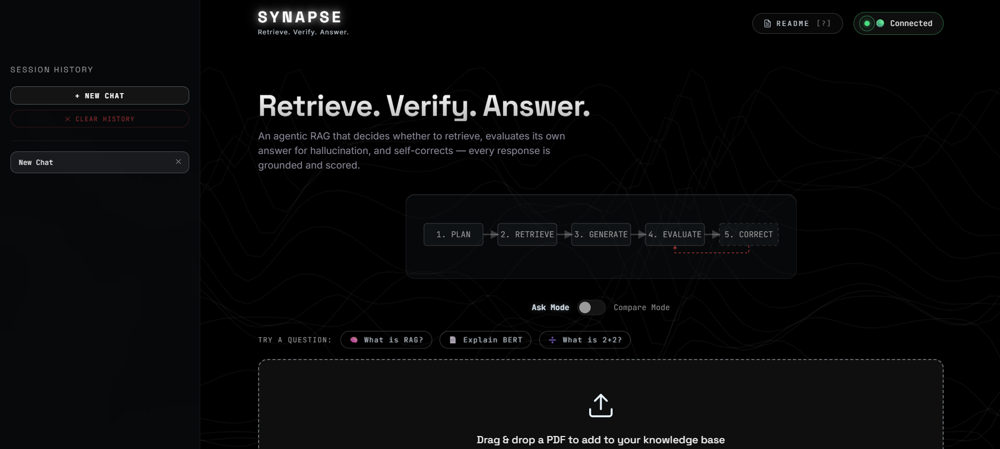
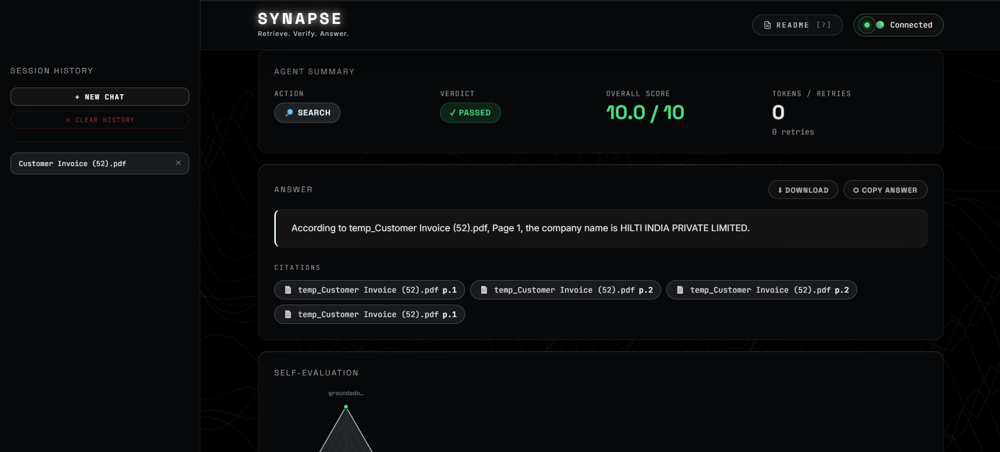
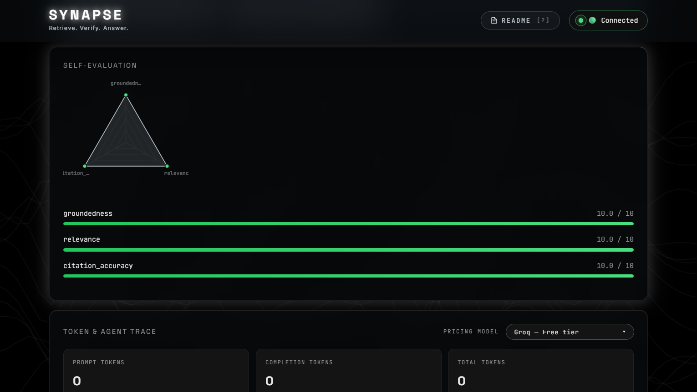

# Synapse — Retrieve. Verify. Answer.

> An agentic RAG system that decides whether to retrieve, evaluates its own outputs for hallucination, and self-corrects — deployed on Render with session isolation and conversation memory.

   

---

## What is Synapse?

Synapse is a self-correcting agentic RAG (Retrieval-Augmented Generation) system. Unlike a standard RAG pipeline that blindly retrieves and generates, Synapse runs a 5-step decision loop:

```
1. PLAN      → LLM decides: search documents or answer from general knowledge?
2. RETRIEVE  → Semantic search across uploaded PDFs with relevance threshold
3. GENERATE  → Answer grounded strictly in retrieved chunks with page citations
4. EVALUATE  → Judge LLM scores groundedness, relevance, citation accuracy (0-10)
5. CORRECT   → If score < 7, rephrase query and retry (max 2 retries)
```

This decision-evaluate-retry loop is what makes it an agent, not just a pipeline.

---

## Live Demo

🔗 **[synapse-t46u.onrender.com](https://synapse-t46u.onrender.com)**

> First load may take 30-40 seconds (Render free tier cold start). The UI shows a warm-up indicator automatically.

Pre-loaded sample documents available on first visit — no upload required to demo.

---

## Screenshots

### Landing Page


### Cited Answer with Page Numbers


### Self-Evaluation Scores


---

## Key Features

- **Agentic decision making** — decides whether to retrieve or answer directly per question
- **Self-evaluation** — LLM-as-judge scores every answer on groundedness, relevance, citation accuracy
- **Self-correction** — retries with rephrased query if evaluation score < 7/10
- **Hallucination detection** — flags answers containing claims not supported by source chunks
- **Page-level citations** — every answer cites exact filename and page number
- **Conversation memory** — sliding window of last 6 turns, LLM summarization beyond 10 turns
- **Session isolation** — each user gets their own ChromaDB collection
- **Compare mode** — ask the same question across all uploaded documents simultaneously
- **Streaming responses** — step-by-step status updates via Server-Sent Events

---

## Evaluation Results

Tested on `rag_paper.pdf` (RAG: Retrieval-Augmented Generation for Knowledge-Intensive NLP Tasks):

| Question | Action | Score | Result |
|---|---|---|---|
| What is retrieval augmented generation? | search | 9.3/10 | ✅ PASS |
| What datasets were used to evaluate? | search | 9.0/10 | ✅ PASS |
| What are the limitations? | search | 3.4/10 | ❌ FAIL (paper lacks limitations section) |
| What is the capital of France? | answer_directly | 9.3/10 | ✅ PASS |
| How does the retriever component work? | search | 10.0/10 | ✅ PASS |

**4/5 pass rate · 8.2/10 average score · Self-correction triggered on hard questions**

> The system correctly identified that the RAG paper doesn't contain a dedicated limitations section and flagged it rather than hallucinating an answer. That's the honest behaviour this system is designed for.

---

## Tech Stack

| Component | Technology | Why |
|---|---|---|
| LLM | Groq API — Llama 3.3 70B | Free, fast inference |
| Embeddings | Google Gemini — gemini-embedding-001 | 768 dims, free, works in India |
| Vector DB | ChromaDB 0.4.24 | In-process, ~50MB RAM, no external server |
| PDF extraction | pdfplumber 0.11.4 | Best accuracy for research papers |
| Chunking | nltk 3.9.1 | Sentence-aware splitting, never cuts mid-sentence |
| Backend | FastAPI 0.115.0 + uvicorn | Production-grade async API |
| Frontend | Single-file HTML/CSS/JS | Zero dependencies, dark neural mesh UI |
| Deployment | Render free tier | Free forever, no credit card for hosting |
| Python | 3.11.9 | Stable compatibility with all dependencies |

---

## Architecture

```
┌─────────────────────────────────────────────────────────┐
│                    User Question                         │
└─────────────────────┬───────────────────────────────────┘
                      ↓
┌─────────────────────────────────────────────────────────┐
│  agent.py — The Agentic Loop                            │
│                                                         │
│  Step 1: PLAN                                           │
│  ┌─────────────────────────────────────────────────┐   │
│  │ LLM: "search" or "answer_directly"?             │   │
│  │ Temperature: 0.0 (deterministic)                │   │
│  └──────────────┬──────────────────────────────────┘   │
│                 ↓                                       │
│  Step 2: RETRIEVE (if search)                           │
│  ┌─────────────────────────────────────────────────┐   │
│  │ embedder.py → embed query via Gemini API        │   │
│  │ vector_store.py → ChromaDB cosine similarity   │   │
│  │ Top 5 chunks, threshold ≥ 0.6                  │   │
│  │ If no results: rephrase + retry (max 2x)        │   │
│  └──────────────┬──────────────────────────────────┘   │
│                 ↓                                       │
│  Step 3: GENERATE                                       │
│  ┌─────────────────────────────────────────────────┐   │
│  │ Groq LLM constrained to retrieved chunks only  │   │
│  │ Must cite: "According to [file], page [N]..."  │   │
│  └──────────────┬──────────────────────────────────┘   │
│                 ↓                                       │
│  Step 4: EVALUATE                                       │
│  ┌─────────────────────────────────────────────────┐   │
│  │ Judge LLM scores the answer:                   │   │
│  │ • groundedness (0-10) × 0.5 weight             │   │
│  │ • relevance (0-10) × 0.3 weight                │   │
│  │ • citation_accuracy (0-10) × 0.2 weight        │   │
│  │ • hallucination_detected: true/false            │   │
│  │ Overall ≥ 7 → PASS, else → retry               │   │
│  └──────────────┬──────────────────────────────────┘   │
│                 ↓                                       │
│  Step 5: RETURN (or retry up to 2x)                    │
│  answer + citations + scores + elapsed time            │
└─────────────────────────────────────────────────────────┘
                      ↓
┌─────────────────────────────────────────────────────────┐
│  memory.py — Conversation Memory                        │
│  Sliding window: last 6 turns passed to LLM            │
│  LLM summarization when history > 10 turns             │
└─────────────────────────────────────────────────────────┘
```

---

## File Structure

```
synapse/
├── config.py              Central config — all settings in one place
├── pdf_processor.py       PDF extraction with page numbers (pdfplumber)
├── chunker.py             Sentence-aware chunking with metadata (nltk)
├── embedder.py            Gemini API embeddings + local fallback
├── vector_store.py        ChromaDB operations + session isolation
├── agent.py               Agentic decision loop (the core)
├── memory.py              Conversation history + LLM summarization
├── evaluator.py           LLM-as-judge batch evaluation
├── main.py                FastAPI backend + SSE streaming
├── Synapse-Retrieve Verify Answer.html  Frontend (single file)
├── sample_documents/
│   ├── attention_is_all_you_need.pdf
│   └── rag_paper.pdf
├── screenshots/
│   ├── screenshot-landing.png
│   ├── screenshot-answer.png
│   └── screenshot-scores.png
├── requirements.txt
├── .env.example
├── .gitignore
├── README.md
└── DECISIONS.md
```

---

## API Endpoints

```
POST   /upload              Upload PDF → extract, chunk, embed, store
POST   /chat                SSE streaming agent response
POST   /compare             Compare question across all uploaded docs
GET    /health              Status check (keep-alive target)
GET    /documents/{id}      List uploaded docs for session
GET    /history/{id}        Conversation history for session
DELETE /session/{id}        Clear session + ChromaDB collection
DELETE /documents/{id}/{f}  Remove specific document from session
```

---

## Running Locally

```bash
# 1. Clone
git clone https://github.com/SphinX-2738/Synapse-Retrieve-Verify-Answer.git
cd Synapse-Retrieve-Verify-Answer

# 2. Create venv with Python 3.11
py -3.11 -m venv venv
venv\Scripts\activate  # Windows
# source venv/bin/activate  # Mac/Linux

# 3. Install dependencies
pip install -r requirements.txt

# 4. Set up environment variables
cp .env.example .env
# Edit .env with your actual keys

# 5. Run
python main.py

# 6. Open
# http://localhost:8000
```

### Required API Keys

| Key | Where to get | Cost |
|---|---|---|
| `GROQ_API_KEY` | console.groq.com | Free |
| `GEMINI_API_KEY` | aistudio.google.com/app/apikey | Free |

---

## Deployment (Render)

```
Build Command:  pip install -r requirements.txt
Start Command:  uvicorn main:app --host 0.0.0.0 --port $PORT

Environment Variables:
  GROQ_API_KEY         = your_key
  GEMINI_API_KEY       = your_key
  EMBED_MODE           = gemini
  APP_URL              = https://your-app.onrender.com
  WEB_CONCURRENCY      = 1
  ANONYMIZED_TELEMETRY = False
  CHROMA_TELEMETRY     = False
```

**Keep-alive strategy (3 layers, $0 cost):**
- Layer 1: UptimeRobot — external ping to `/health` every 14 minutes
- Layer 2: Self-ping — async task inside FastAPI pings `/health` every 14 minutes
- Layer 3: Frontend — shows warm-up UI on cold start, polls until ready

---

## RAM Budget (Render Free Tier — 512MB limit)

```
FastAPI + uvicorn       ~80MB
ChromaDB               ~50MB
pdfplumber             ~20MB
Python runtime         ~60MB
google-genai client    ~10MB
Buffer                 ~100MB
─────────────────────────────
Total                  ~320MB  ✅ well under 512MB
```

---

## Portfolio Context

This is Project 3 of a 3-project Gen AI portfolio:

| Project | What it proves |
|---|---|
| LLM Evaluation Tester | I can measure AI quality, not just build with it |
| Docstract | I can build production extraction pipelines |
| **Synapse** | **I can build self-correcting agents with grounded, cited answers** |

**Combined narrative:** "I build AI systems I can prove work — evaluation baked in from the start."

---

## Author

**Ankur Sharma** — Gen AI Engineer
- Transitioning from Data Analytics into Gen AI
- Google Cloud Generative AI Leader certified
- OCI Gen AI certified

*"I don't just build AI. I prove it works."*
